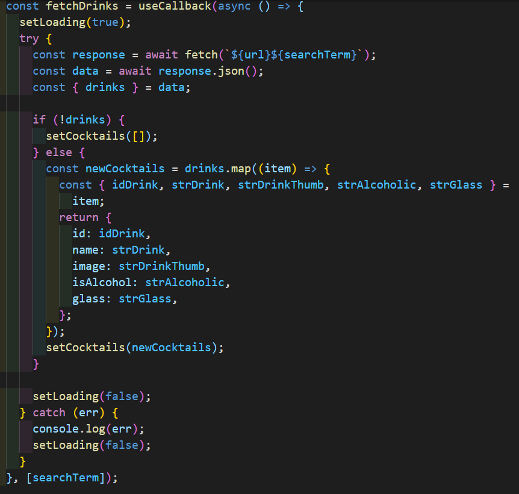
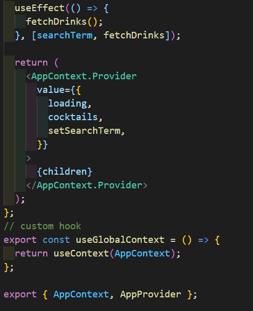
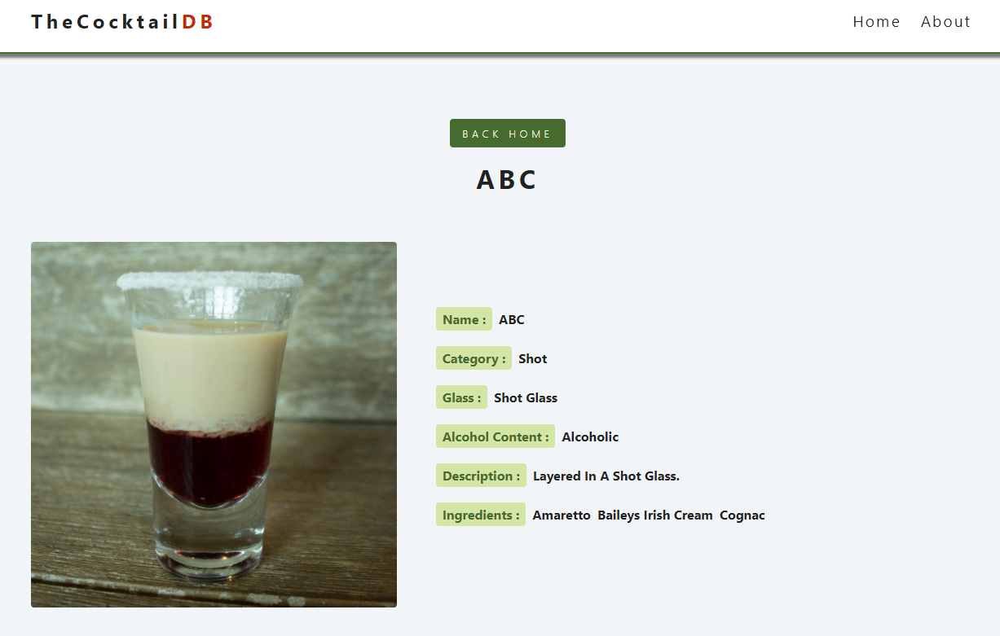

## Cocktail-Search

[Go to WEB](https://c0cktail.netlify.app/)

1. build : create-react-app
2. deploy : netlify

 

### ✨ Main Logic

 

 

### ✨ Screen Shot

 

 

---

Source : [JAVASCRIPT 30](https://javascript30.com/)
